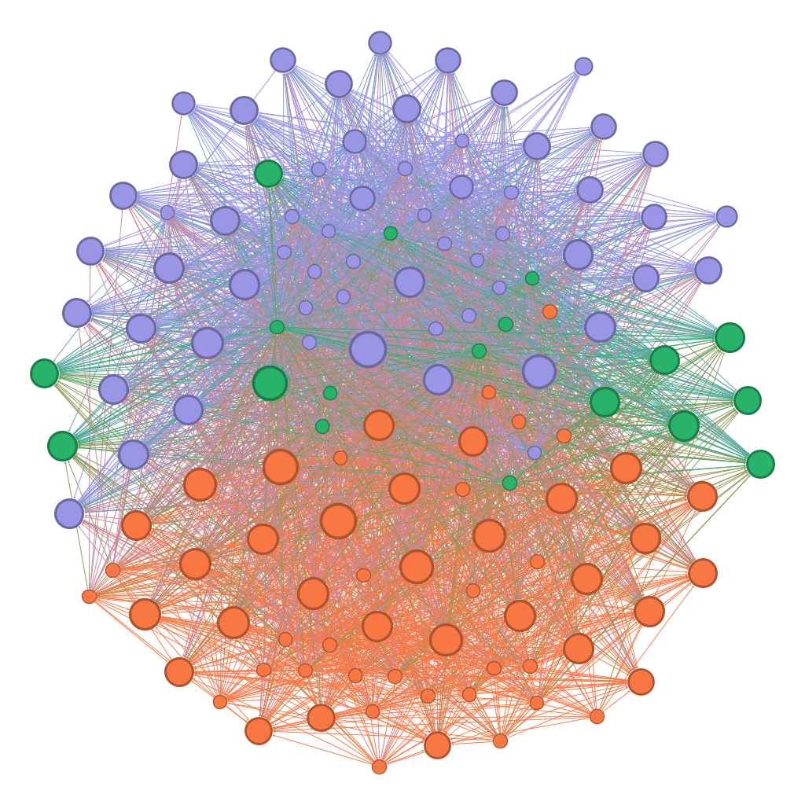

# GephiDatasets
This is an independent repository of datasets for learning and mastering Gephi. It is completely open source, which means that anybody is welcome to contribute datasets to this repository by submitting a pull request. 
Datasets can be in any form that can be consumed in Gephi, such as CSV, GraphML, and GEXF. 

This repository has no direct affiliation with Gephi. Nevertheless, its goal is to be a source of high-quality ready-to-load datasets for learning and mastering Gephi.

Presently, this repository contains datasets scraped from Twitter, Spotify, [OpenAlex.org](https://openalex.org/), and Bluesky. Our goal is to keep populating it with datasets scraped from publicly available data sources via their APIs.

